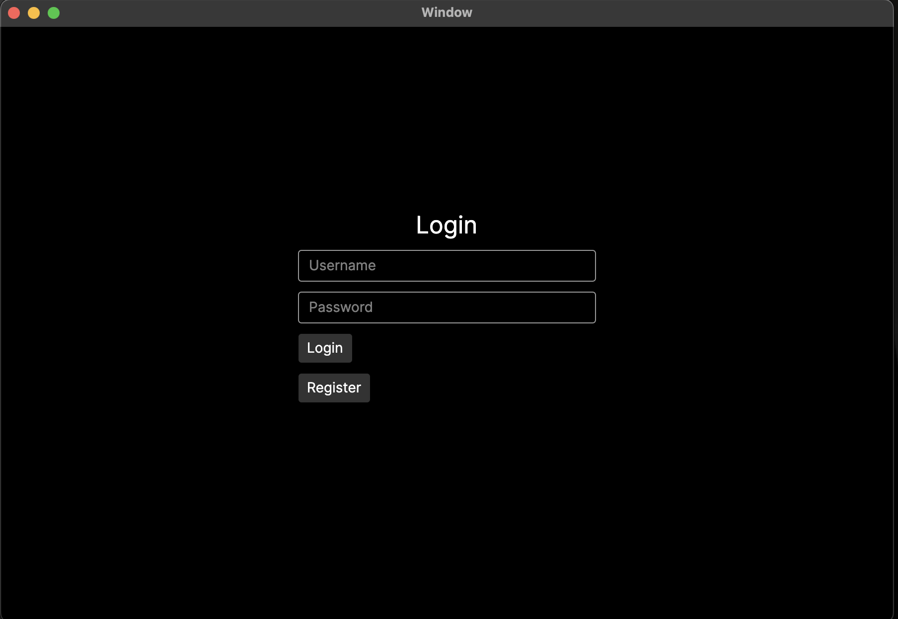
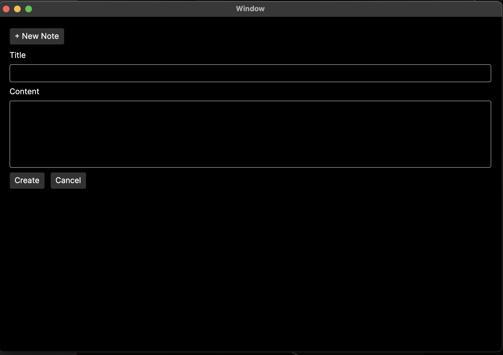
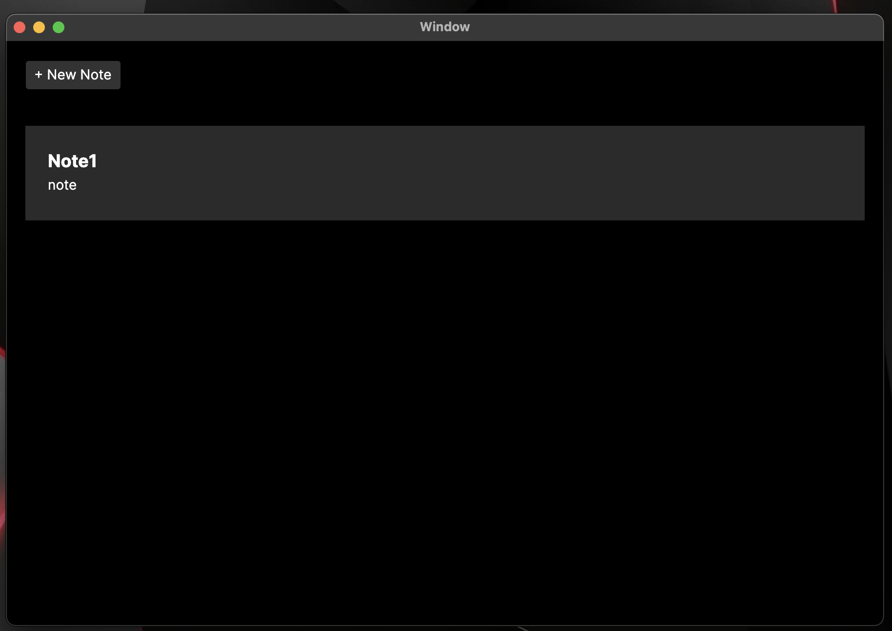
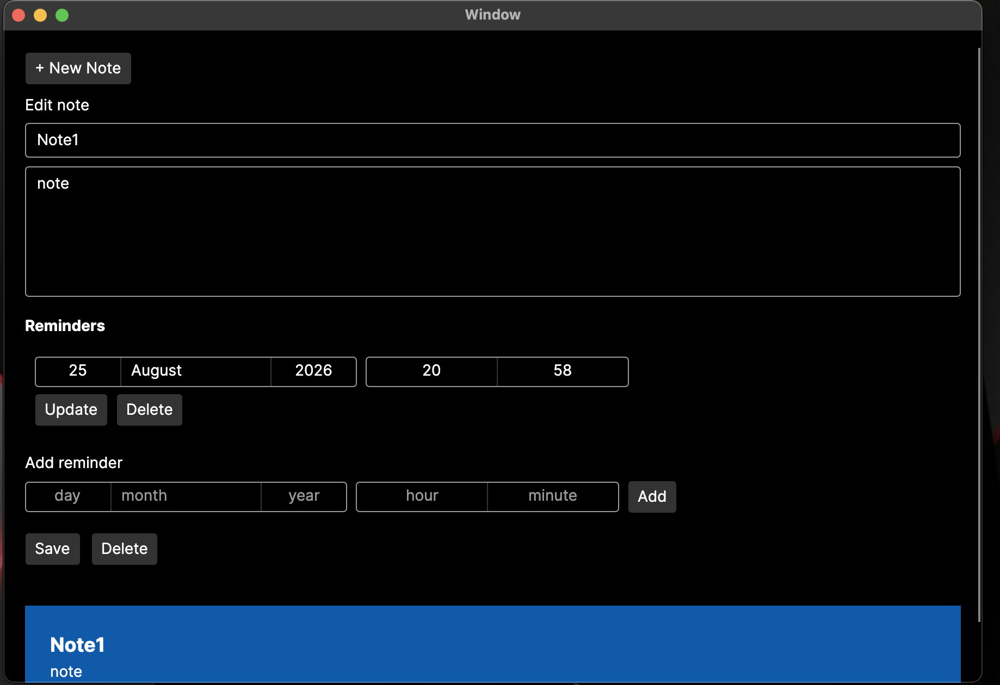

# RemindersApp

A full-stack notes and reminders application built with ASP.NET Core and Avalonia UI.

The project provides a REST API for authentication, notes, and reminders, along with a desktop client for interacting with the application.

## Features

- User registration and login
- Authentication and authorization
- User-specific notes
- Create, read, update and delete notes
- Soft deletion of notes
- Create, update and delete reminders
- Protection against accessing another user's notes
- SQLite database
- Background reminder processing
- Global exception handling
- Automated unit and integration tests
- Cross-platform desktop client built with Avalonia UI

## Architecture

The solution is divided into separate projects following a layered architecture:
```text
NotesReminders.Domain
        ↑
NotesReminders.Application
        ↑
NotesReminders.Infrastructure
        ↑
NotesReminders.Api

NotesReminders.Desktop
        ↓
NotesReminders.Api

NotesReminders.Tests
        ↓
Application / API / Infrastructure
```

### Projects

| Project | Purpose |
| --- | --- |
| NotesReminders.Domain | Domain entities and core models |
| NotesReminders.Application | Application services, DTOs and business logic |
| NotesReminders.Infrastructure | Entity Framework Core, database access and background services |
| NotesReminders.Api | ASP.NET Core REST API, authentication and HTTP endpoints |
| NotesReminders.Desktop | Avalonia UI desktop client |
| NotesReminders.Tests | Unit and integration tests |

## Technologies

- C#
- .NET 10
- ASP.NET Core Web API
- Entity Framework Core
- SQLite
- Avalonia UI
- OpenAPI
- xUnit

## Authentication and Authorization

The API provides user registration and login functionality.
Protected resources are associated with the authenticated user. Notes and their reminders cannot be accessed or modified by other users.
Authorization is tested through integration tests covering attempts to:
- Read another user's note
- Update another user's note
- Delete another user's note
- Add a reminder to another user's note
- Modify another user's reminder
- Delete another user's reminder

## API

The API exposes endpoints for authentication, notes, and reminders.

### Authentication
```text
POST /api/Auth/register
POST /api/Auth/login
```
### Notes
```text
GET    /api/Notes
GET    /api/Notes/{id}
POST   /api/Notes
PUT    /api/Notes/{id}
DELETE /api/Notes/{id}
POST   /api/Notes/{id}/Reminders
PUT    /api/Notes/{id}/Reminders/{id}
DELETE /api/Notes/{id}/Reminders/{id}
```
The API also provides reminder operations associated with notes.
OpenAPI documentation is available when running the API in the Development environment.

## Testing

The project contains both unit and integration tests.
The integration tests run against the API and database together, covering authentication, authorization, controllers and application behavior.
Current test suite:
52 tests
52 passed
0 failed

Run the tests with:
dotnet test

## Running the Project

### Requirements

- .NET 10 SDK

Run the API
```text
dotnet run --project NotesReminders.Api
```
Run the Desktop Application
```text
dotnet run --project NotesReminders.Desktop
```
Run Tests
```text
dotnet test
```
The API uses SQLite for persistence.

## Project Structure
```text
RemindersApp/
│
├── NotesReminders.Api/
│   ├── Controllers/
│   ├── Extensions/
│   └── Middleware/
│
├── NotesReminders.Application/
│
├── NotesReminders.Domain/
│
├── NotesReminders.Infrastructure/
│
├── NotesReminders.Desktop/
│
├── NotesReminders.Tests/
│   ├── Integration/
│   └── Services/
│
├── NotesReminders.sln
├── .gitignore
├── LICENSE
└── README.md
```
## Screenshots





## Purpose

This project was created as a practical .NET development project to build experience with developing a complete application rather than isolated examples.

It covers:
- ASP.NET Core Web API development
- Layered application architecture
- Dependency injection
- Entity Framework Core
- SQLite persistence
- Authentication and authorization
- DTO-based API design
- Exception handling middleware
- Background services
- REST API development
- Avalonia UI
- Unit and integration testing